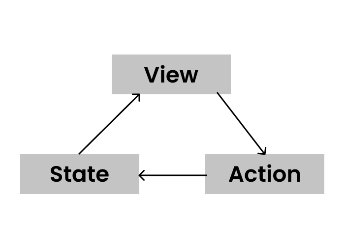
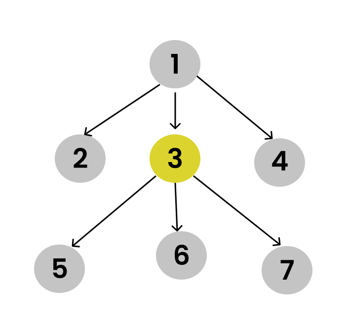

## Introduction
**React** is a JavaScript library for building user interfaces. It is mainly used to develop Single Page Applications (SPAs). It was created by Jordan Walke, a software engineer at Facebook, and was released on Facebook's News Feed in 2011 and later on Instagram in 2012.

React follows some key principles, because of which it became popular in a short period.

Here are the 4 key principles of React JS.

### 1. Imperative VS Declarative
#### Imperative
In an imperative approach, we write step-by-step approaches to solve a problem. We need to explicitly say what kind of DOM manipulations to make at each step to arrive at the final UI.

Example: Let's take an array and we want to get the elements whose values are greater than 10.

```
const arr = [1, 12, 15, 9, 4]; 
const result = []; 

for(let i = 0; i < arr.length; ++i) { 
  if ( arr[i] > 10 ) { 
    result.push(arr[i]);
  }
}

// output: [12, 15]
```
Here we need to loop through each index of the array and then compare each element is greater than 10. Then push it to a new array and display the result. This is a little complex method.

Let's see the declarative approach now.
#### Declarative
In the declarative approach, we are just concerned about the final state or the UI. We are not focusing on how we arrive at the final state.

Example: Let's take the same example of fetching the elements greater than 10.
```
const arr = [1, 12, 15, 9, 4];
const result = arr.filter(element => { return element > 10; }) 

// output: [12, 15]
```

Here we are using the filter array method and hiding the complexity of looping through the array.

React uses a declarative approach and we need not tell it how to interact with the DOM; we just write code on what you want to see on the screen and React does the rest of the job. Also, this reduces a lot of complexities.

### 2. Everything is a component

Everything in React is built using components. A small component is embedded in a bigger component and made as a whole web app.

A component is just a JavaScript function, which takes arguments called as props and return React Elements to display (render) on the page.

The advantage of using components is we can share and reuse these components and this helps us to follow the DRY (Do Not Repeat) principle.

### 3. One-way data flow (Unidirectional)

Data in React always flows in only one direction, it always moves downwards that is from the parent node to the child node. Data in the parent component is called state, it is passed to the child as props.

State is just an JavaScript object which stores some information, and it gets updated based on the actions of the user.



React builds the view using that state object. Whenever we want to change any view, the user triggers some kind of action that in turn changes the state and then this updated state changes the view.

Let's take one example



The above image shows all the structure of some React apps. Let's assume that the state lives in node 3, now due to some action if any change happens to the state then, only node 5, 6, and 7 gets affected and other nodes are not touched. Child nodes cannot update the parent state, they can just consume the data. This is unidirectional data flow.

Because of this restriction on data, it makes debugging and fixing bugs easier for developers.

### 4. It is just a UI library

React is just a UI library, which means it only focuses on the view, for the rest of the things such as routing, state management, and API fetching we need to use other libraries such as react-router-dom, react-query, redux, etc.

React follows the principle of Learn Once, Write Anywhere, which means you can use React principles on any platform like mobile, desktop, web, terminal, etc. You just need a React Library and also one React view library for particular platforms. react-dom is used for web apps and similarly, react-native is used for mobile apps.

You can build:
- Web app with React JS
- Mobile & IOS apps with React Native
- VR apps with React VR, etc.
## Summary
In this article, we learned about the key principles on which ReactJs works they are.
* Imperative VS Declarative
* Everything is a component
* One-way data flow
* It is just a UI library
